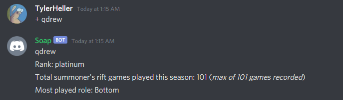
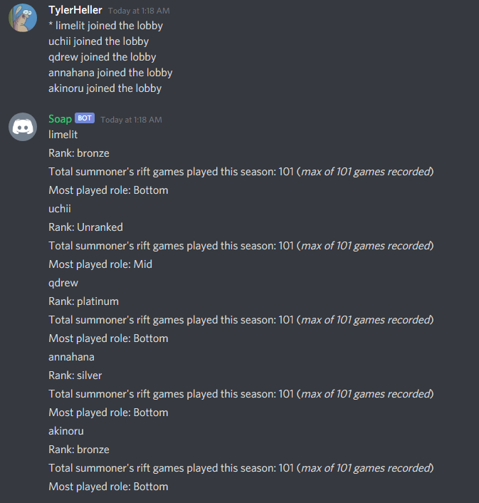
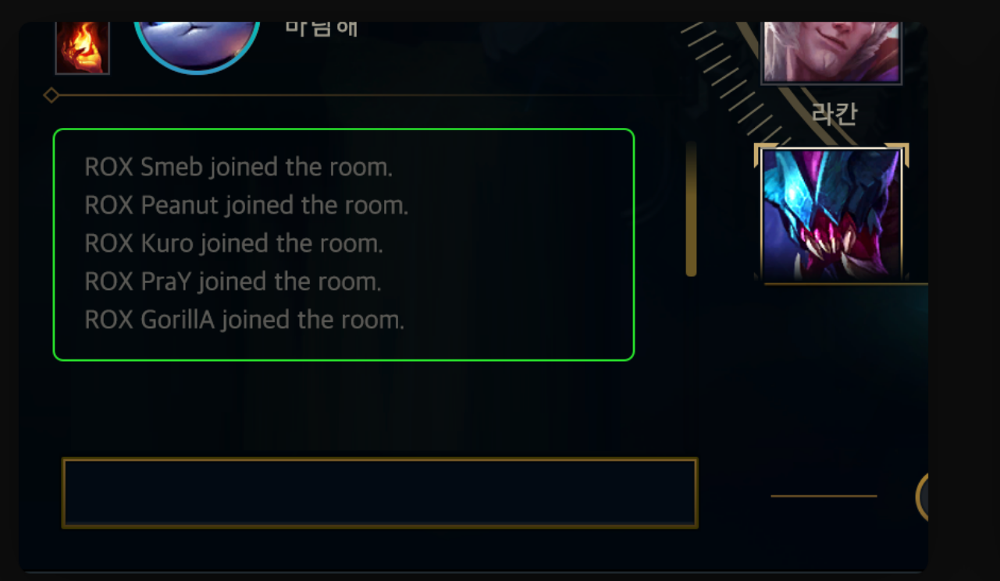

# League of Legends Player Statistics Discord Bot
**Does not include Riot api key or Discord Bot token**

---
**Description**  
Discrod bot that displays a player's statistics by typing their username in a discord server where the bot is located.  
Player Statistics includes player rank, total games played and most played role.  

To look up a single players statistics type in discord chat + followed by a space then their username.  
To look up a multiple players statistics type in discord chat * followed by a space then the content from champion select chat.  
(see Example Output section down below for clarification).  

This bot requires your own Riot Game API key which can be found at https://developer.riotgames.com/  
and a Discord bot Token which can be found at https://discord.com/developers/applications  

---

**Purpose**  
This discord bot aims to consolidate popular functionality of 3rd party League of Legands statistics websites within popular instant messaging application Discord.  

---

# Libary
**JDA (Java Discord API)**  - JDA-4.2.0_184  

---

# Example Output #
**Single Search**  
  
**Multiple Search**  
  
**Champion Select Chat**  
  
